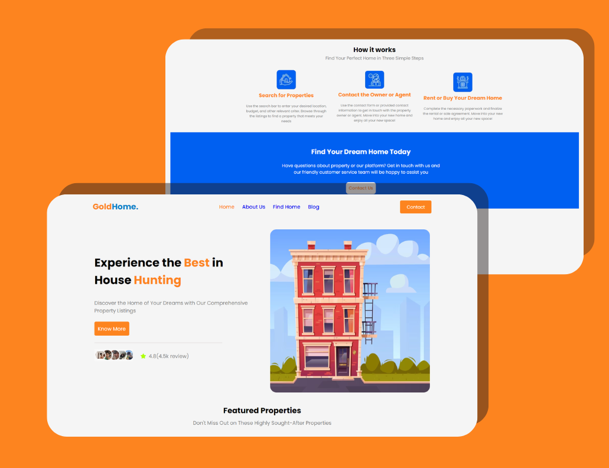

# Interior Labs

Welcome to Interior Labs - Your one-stop solution for interior design inspiration. Explore a curated collection of stunning interior designs from around the world. Whether you are looking for ideas for your home or a professional designer seeking inspiration, Interior Labs has something for everyone.

## Table of Contents
- [Description](#description)
- [Live Demo](#live-demo)
- [Installation](#installation)
- [Usage](#usage)
- [Technologies Used](#technologies-used)
- [Contributing](#contributing)

## Description

Interior Labs is a web application that provides a visually rich and diverse selection of interior designs. The platform aims to inspire users and help them discover unique ideas for their interior design projects. From contemporary styles to traditional aesthetics, Interior Labs showcases various themes to cater to different preferences.

## Live Demo

## Installation

1. Clone the repository: `git clone https://github.com/your-username/interior-labs.git`
2. Navigate to the project directory: `cd interior-labs`
3. Install dependencies: `npm install`

## Usage

1. Download 'Live Server' Extension.
2. Right Click on index.html
3. Open with Live Server
4. Will open in browser

## Technologies Used

- JS for adding functionalities
- HTML5
- CSS3 for styling

## Contributing

Contributions are welcome! If you have any ideas, suggestions, or bug fixes, please open an issue or submit a pull request.
